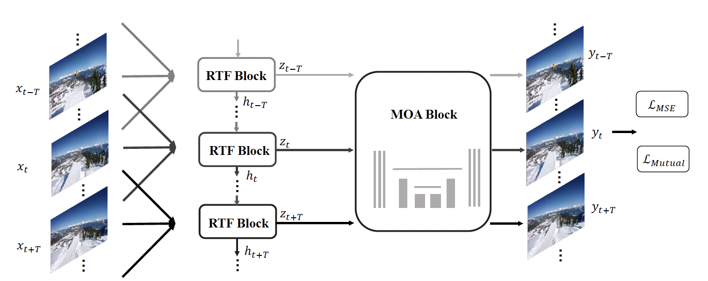

# ReMoNet: Recurrent Multi-output Network for Efficient Video Denoising

Implementation of   
"[ReMoNet: Recurrent Multi-output Network for Efficient Video Denoising](https://ojs.aaai.org/index.php/AAAI/article/view/20182)"   
Liuyu Xiang, Jundong Zhou, Jirui Liu, Zerun Wang, Haidong Huang, Jie Hu, Jungong Han, Yuchen Guo, Guiguang Ding;

in AAAI 2022




## Requirements

* [PyTorch](https://pytorch.org/) >=1.1.0
* scikit-learn
* opencv


## Data Preparation

Follow [FastDVDNet](https://github.com/m-tassano/fastdvdnet) for data preparation.


## Experiments with Gaussian Noise 

Step 1: Change trainset_dir & valset_dir to your path

Step 2: python train_ReMoNet.py --log_dir path/to/logdir


## Experiments with ISP simulated Noise 

Step 1: 
First use ISP_sim_code to generate ISP simulated data

Step 1.1 
Change im_folder and out_dir in generate_dataset_patches.py

Step 1.2
python generate_dataset_patches.py

The result is saved in args.out_dir/train.h5

Note:
The process could be slow and take up to ~12 hours to finish for DAVIS-train. Once finished, the training is fast ^_^.


Step 2:
python train_ReMoNet.py --log_dir path/to/logdir


## Citation

If you find our work useful for your research, please consider citing the following paper:
```
@article{article,
author = {Xiang, Liuyu and Zhou, Jundong and Liu, Jirui and Wang, Zerun and Huang, Haidong and Hu, Jie and Han, Jungong and Guo, Yuchen and Ding, Guiguang},
year = {2022},
month = {06},
pages = {2786-2794},
title = {ReMoNet: Recurrent Multi-Output Network for Efficient Video Denoising},
volume = {36},
journal = {Proceedings of the AAAI Conference on Artificial Intelligence},
doi = {10.1609/aaai.v36i3.20182}
}
```

## Contact

If you have any questions, please feel free to contact xiangly55@foxmail.com


## Acknowledgement
The code is partly based on [FastDVDNet](https://github.com/m-tassano/fastdvdnet). The ISP simulated pipeline is borrowed from [camera_sim](https://github.com/12dmodel/camera_sim). Many thanks to them!